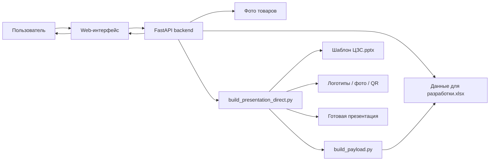

```mermaid
flowchart LR
  User["Пользователь"] --> UI["Web-интерфейс"]
  UI --> API["FastAPI backend"]
  API --> Excel["Данные для разработки.xlsx"]
  API --> Photos["Фото товаров"]
  API --> Builder["build_presentation_direct.py"]
  Builder --> Payload["build_payload.py"]
  Payload --> Excel
  Builder --> Template["Шаблон ЦЗС.pptx"]
  Builder --> Assets["Логотипы / фото / QR"]
  Builder --> PPTX["Готовая презентация"]
  API --> UI
  UI --> User
```